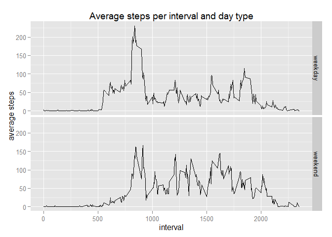

# Reproducible Research: Peer Assessment 1

## Loading and preprocessing the data

```r
unzip("activity.zip")
data <- read.csv("activity.csv")
library(dplyr, warn.conflicts = FALSE)
data_day <- data %>% group_by(date) %>% summarize(total_steps = sum(steps))
data_interval <- data %>% group_by(interval) %>% 
        summarize(mean_steps = mean(steps, na.rm=TRUE))
```


## What is mean total number of steps taken per day?

```r
with(data_day, hist(total_steps, col="red", xlab="total steps", ylim=c(0,30), 
     main ="total steps per day"))
```

 

```r
total_steps_mean <- mean(data_day$total_steps, na.rm=TRUE)
total_steps_median <- median(data_day$total_steps, na.rm=TRUE)
```

**total steps mean:** 10766.19  
**total steps median:** 10765  
  

## What is the average daily activity pattern?

```r
with(data_interval, plot(interval, mean_steps, type="l", col="blue", 
                         xlab="interval", ylab="average steps"))
title(main ="average steps per interval")
```

 

```r
max_interval <- data_interval %>% filter(mean_steps==max(mean_steps))
```

**maximum steps interval =** 835  
  

## Imputing missing values
### Total number of missing values

```r
sum(is.na(data$steps))
```

```
## [1] 2304
```
### New data with missing values filled in with the mean for that interval

```r
ndata <- merge(data, data_interval, by.x="interval", by.y="interval", all=TRUE)
x <- is.na(ndata$steps)
ndata$steps[x] <- ndata$mean_steps[x]
```
### Histogram of total steps by day, mean and median

```r
ndata_day <- ndata %>% group_by(date) %>% summarize(total_steps = sum(steps))

with(ndata_day, hist(total_steps, col="red", xlab="total steps", ylim=c(0,35), 
     main ="total steps per day"))
```

 

```r
ntotal_steps_mean <- mean(ndata_day$total_steps, na.rm=TRUE)
ntotal_steps_median <- median(ndata_day$total_steps, na.rm=TRUE)
```

**new total steps mean:** 10766.19  
**new total steps median:** 10766.19  
Both values do not barely differ from first estimated values.  

## Are there differences in activity patterns between weekdays and weekends?

```r
Sys.setlocale("LC_TIME", "English")
```

```
## [1] "English_United States.1252"
```

```r
ndata$daytype <- factor(ifelse(weekdays(as.Date(ndata$date)) %in% 
                                       c("Saturday", "Sunday"), "weekend", "weekday"))
ndata_interval_wd <- ndata %>% group_by(interval, daytype) %>%
        summarize(nmean_steps=mean(steps))

library(ggplot2, warn.conflicts = FALSE)
g <- ggplot(ndata_interval_wd, aes(interval, nmean_steps))
g + geom_line() + facet_grid(daytype~.) + 
        labs(title="Average steps per interval and day type", y="average steps")
```

 
  
There are visible differences between weekdays and weekends. On weekends the distribution
is more uniform during the day, and the maximum at 08:35 corresponds to weekdays.  


